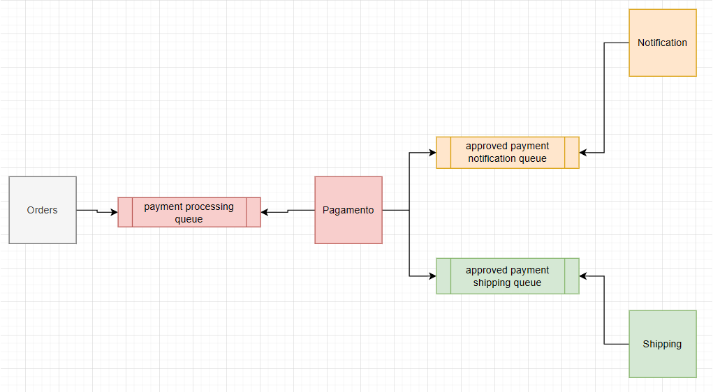

<!-- title -->
<h1 align="center">
    <span>Projeto ViaCEP</span>
</h1>

<br>

<!-- badges -->
<div align="left">
    </img>
    </img>
    </img>
</div>

<br>

<!-- About -->
##  Sobre o Projeto

Este projeto simula um fluxo de processamento de pedidos utilizando microserviços e RabbitMQ. O objetivo é demonstrar a comunicação assíncrona entre serviços via mensagens, seguindo o padrão de arquitetura de eventos.

<hr>
<br>


<!-- Diagrama microserviços -->
##  Diagrama dos microserviços

	

<br>

Fluxo Resumido do Projeto:

1. Usuário cria um pedido via rota POST no Orders Service.

2. Orders envia o pedido para a fila de análise de pagamento.

3. Payment Service consome a mensagem da fila, processa o pagamento e envia o resultado para:

     1. Fila de notificação para pagamentos aprovados (para notificar o usuário)

     1. Fila de envio para pagamentos aprovados (se aprovado, para despachar o pedido)

4. Notification Service envia a notificação ao usuário sobre o status do pedido.

5. Shipping Service simula o envio do pedido.

<hr>
<br>

<!-- Technologies -->
##  Tecnologias
- Java 17
- Spring Boot 4.0.1
- Spring Web
- Spring Boot DevTools
- lombok
- OpenAPI (Swagger)
- Docker 27.0.3
- RabbitMQ

<hr>
<br>

##  Endpoints


| Método Http | URI | Descrição | Status Code esperado |                  
| :---:       | :--- |  :---    | :---:                |
| POST   | `http://localhost:8080/orders`      |         Criação de pedidos via microserviço Orders        | 200 |


<hr>
<br>

## Documentação no Swagger

	

<br>

<hr>
<br>

<!-- Build and run -->
##  Rodando a aplicação

### Requisitos
- [git](https://git-scm.com/downloads)
- [Docker](https://docs.docker.com/desktop/wsl/)

<br>

### Passo a passo

1. Clone esse repositório
    ```bash
    git clone https://github.com/lGabrielDev/projeto_viaCEP
    ```
<br>

2. Vá ao diretorio

    ```bash
    cd projeto_viaCEP
    ```

<br>

3. Atribua os valores nas variáveis de ambiente

    

<br>

4.  Rode os comandos de execução:

    ```bash
     mvn clean package -DskipTests;  # Compila o código Java e gera o arquivo .jar
     docker pull openjdk:17-ea-10-jdk;  # Baixa a imagem base do OpenJDK 17.
     docker compose up --build; # Constrói as imagens Docker e sobe os containers
    ```

<br>

5. Acesse o swagger: `http://localhost:8080/swagger.html`

<hr>
<br>

<!-- Credits -->
<h2>
    
    <span>Créditos</span>
</h2>

<p>As imagens usadas nesse projeto foram retiradas dos seguintes sites:</p>

- [viaCEP](https://viacep.com.br/)
- [shields.io](https://shields.io/)
- [iconfinder](https://www.iconfinder.com/)
- [storyset](https://storyset.com/)
- [vecteezy](https://www.vecteezy.com)


<span>Thanks!</span>

<hr>
<br>


<!-- License -->
##  Licença --> MIT

O projeto está sob a licença do [MIT](LICENSE).

<hr>
<br>

<!-- Author -->
##  Autor

<br>

<div align="center">
    
    <p> <a href="https://github.com/lGabrielDev">Gabriel Freitas</a> 😎 </p>
</div>